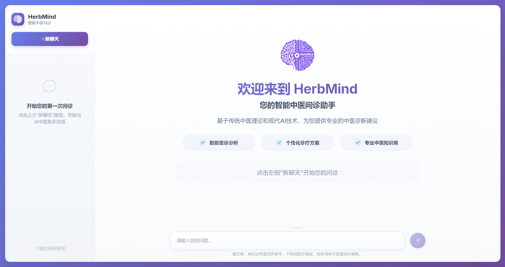

# HerbMind - 智能中医问诊助手

<div align="center">


**基于传统中医理论和现代AI技术的智能问诊系统**

[](https://vuejs.org/)
[](https://www.typescriptlang.org/)
[](https://element-plus.org/)
[](https://vitejs.dev/)

[在线演示](#) | [问题反馈](https://github.com/haowen6/herbmind/issues) | [功能特性](#功能特性)

</div>

## 📖 项目简介

HerbMind 是一个基于 Vue 3 + TypeScript 开发的智能中医问诊前端应用，结合传统中医理论和现代AI技术，为用户提供专业的中医诊断建议。系统支持智能舌诊分析、个性化诊疗方案制定、专业中医知识库查询等功能。

## 🖼️ 应用展示

<div align="center">



*HerbMind 智能中医问诊助手 - 首页界面展示*

</div>

## ✨ 功能特性

### 🏥 核心功能
- **智能问诊对话** - 基于AI的中医问诊系统，模拟真实医生问诊流程
- **智能舌诊分析** - 支持舌象图片上传，AI自动分析舌质、舌苔等特征
- **个性化诊疗方案** - 根据用户症状和体质，提供个性化的中医治疗方案
- **专业中医知识库** - 集成丰富的中医理论知识和临床经验

### 💬 交互体验
- **多轮对话** - 支持连续多轮问诊对话，AI根据上下文提供连贯建议
- **选项选择** - 智能提供症状选项，用户可快速选择或自定义输入
- **实时流式响应** - 支持AI回复的流式显示，提供更好的用户体验
- **会话管理** - 支持多会话管理，可保存和回顾历史问诊记录

### 🎨 界面设计
- **现代化UI** - 采用Element Plus组件库，界面简洁美观
- **响应式设计** - 支持多种设备尺寸，提供良好的移动端体验
- **主题定制** - 支持深色/浅色主题切换，个性化界面风格
- **无障碍访问** - 遵循WCAG标准，支持屏幕阅读器等辅助技术

## 🛠️ 技术栈

### 前端框架
- **Vue 3** - 渐进式JavaScript框架，使用Composition API
- **TypeScript** - 静态类型检查，提高代码质量和开发效率
- **Vite** - 下一代前端构建工具，提供极速的开发体验

### UI组件库
- **Element Plus** - 基于Vue 3的企业级UI组件库
- **@element-plus/icons-vue** - Element Plus图标库

### 状态管理
- **Pinia** - Vue 3官方推荐的状态管理库

### 工具库
- **Axios** - HTTP客户端，用于API请求
- **Markdown-it** - Markdown解析器，支持富文本显示
- **Highlight.js** - 代码语法高亮

### 开发工具
- **@vitejs/plugin-vue** - Vite的Vue插件
- **unplugin-auto-import** - 自动导入API
- **unplugin-vue-components** - 自动导入组件

## 🚀 快速开始

### 环境要求
- Node.js >= 16.0.0
- npm >= 8.0.0 或 yarn >= 1.22.0

### 安装依赖
```bash
# 克隆项目
git clone https://github.com/haowen6/herbmind.git
cd herbmind

# 安装依赖
npm install
# 或
yarn install
```

### 开发环境运行
```bash
# 启动开发服务器
npm run dev
# 或
yarn dev

# 访问 http://localhost:5173
```

### 生产环境构建
```bash
# 构建生产版本
npm run build
# 或
yarn build

# 预览构建结果（需要先安装serve）
npx serve dist
# 或使用其他静态文件服务器
```

## ⚙️ 配置说明

### 环境变量
创建 `.env.local` 文件（已添加到.gitignore）：
```bash
# API基础URL
VITE_API_BASE_URL=http://127.0.0.1:8000

# API认证令牌
VITE_API_TOKEN=your-api-token
```

### API配置
项目默认连接到本地后端服务（端口8000），如需修改请更新环境变量中的 `VITE_API_BASE_URL`。

## 📁 项目结构

```
herbmind/
├── public/                 # 静态资源
├── src/                    # 源代码
│   ├── api/               # API接口
│   │   ├── api.d.ts       # API类型定义
│   │   └── api.js         # API实现
│   ├── components/        # Vue组件
│   │   ├── ChatArea.vue   # 聊天区域组件
│   │   ├── MessageItem.vue # 消息项组件
│   │   └── Sidebar.vue    # 侧边栏组件
│   ├── store/             # 状态管理
│   │   └── inquiry.ts     # 问诊状态管理
│   ├── types/             # 类型定义
│   │   ├── global.d.ts    # 全局类型
│   │   └── vue.d.ts       # Vue类型扩展
│   ├── utils/             # 工具函数
│   │   └── markdown.ts    # Markdown处理工具
│   ├── App.vue            # 根组件
│   ├── main.ts            # 应用入口
│   └── logo.png           # 应用Logo
├── index.html             # HTML模板
├── package.json           # 项目配置
├── tsconfig.json          # TypeScript配置
├── vite.config.ts         # Vite配置
└── README.md              # 项目说明
```

## 🔧 开发指南

### 代码规范
- 使用TypeScript进行类型检查
- 遵循Vue 3 Composition API最佳实践
- 组件命名采用PascalCase
- 文件命名采用kebab-case

### 组件开发
- 每个组件都有明确的职责和接口
- 使用Props和Emits进行组件通信
- 状态管理统一使用Pinia store

### API集成
- 所有API调用封装在`src/api/`目录下
- 使用Axios进行HTTP请求
- 统一的错误处理和响应格式

## 🧪 测试

```bash
# 类型检查
npx vue-tsc --noEmit

# 代码检查（如果配置了ESLint）
npx eslint src --ext .vue,.ts,.js

# 注意：当前项目暂未配置单元测试和E2E测试
# 如需添加测试，建议使用 Vitest 和 Cypress
```

## 📦 部署

### 静态部署
```bash
# 构建生产版本
npm run build

# 将dist目录部署到Web服务器
```

### Docker部署
```dockerfile
# Dockerfile示例
FROM node:18-alpine as build
WORKDIR /app
COPY package*.json ./
RUN npm ci --only=production
COPY . .
RUN npm run build

FROM nginx:alpine
COPY --from=build /app/dist /usr/share/nginx/html
EXPOSE 80
CMD ["nginx", "-g", "daemon off;"]
```

## 🤝 贡献指南

我们欢迎所有形式的贡献！请查看以下指南：

### 提交Issue
- 使用清晰的标题描述问题
- 提供详细的复现步骤
- 包含环境信息和错误日志

### 提交PR
1. Fork项目到你的GitHub账户
2. 创建功能分支：`git checkout -b feature/amazing-feature`
3. 提交更改：`git commit -m 'Add amazing feature'`
4. 推送到分支：`git push origin feature/amazing-feature`
5. 创建Pull Request

### 代码审查
- 确保代码通过所有测试
- 遵循项目的代码规范
- 添加必要的文档和注释

## 📄 许可证

本项目采用 [MIT License](LICENSE) 许可证。

## 🙏 致谢

- [Vue.js](https://vuejs.org/) - 渐进式JavaScript框架
- [Element Plus](https://element-plus.org/) - Vue 3 UI组件库
- [Vite](https://vitejs.dev/) - 下一代前端构建工具
- [Pinia](https://pinia.vuejs.org/) - Vue状态管理库

## 📞 联系我们

- 项目主页：[https://github.com/haowen6/herbmind](https://github.com/haowen6/herbmind)
- 问题反馈：[Issues](https://github.com/haowen6/herbmind/issues)
- 功能建议：[Discussions](https://github.com/haowen6/herbmind/discussions)

---

<div align="center">

**如果这个项目对你有帮助，请给它一个⭐️星标！**

Made with ❤️ by [haowen6](https://github.com/haowen6)

</div>
